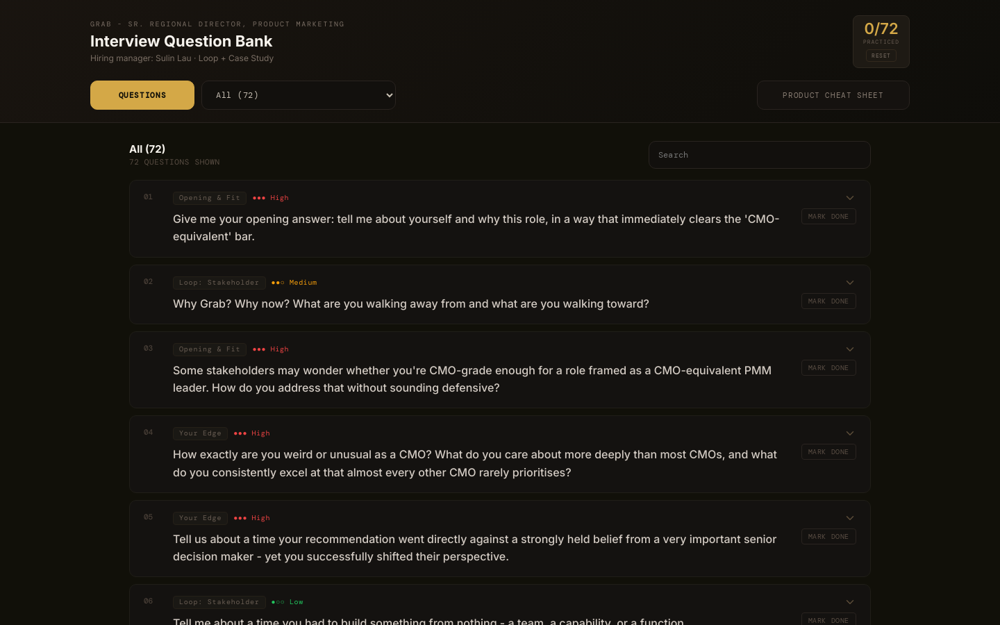
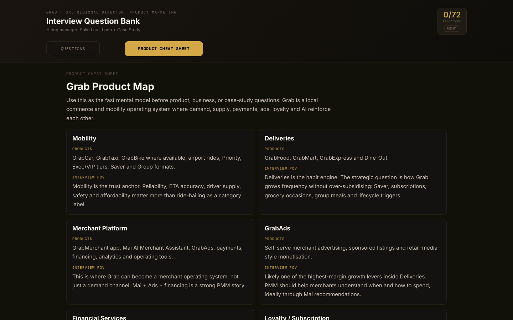

<div align="center">
  <h1>Executive Interview Question Bank 🎙️</h1>

  **An interactive, highly structured interview-prep tool designed for senior leadership roles.**

  [](https://developer.mozilla.org/en-US/docs/Web/HTML)
  [](https://developer.mozilla.org/en-US/docs/Web/CSS)
  [](https://developer.mozilla.org/en-US/docs/Web/JavaScript)
  [](https://vercel.com/)
</div>

---

## 📖 Overview

The **Executive Interview Question Bank** is a purpose-built web application that transforms scattered interview research, company facts, and personal career stories into a structured, interactive practice environment. 

Preparing for a senior role (Director, VP, or C-level) requires more than just rehearsing generic behavioural questions. It demands deep company research, strategic points of view (POVs), and the ability to navigate complex cross-functional case studies. This tool acts as a "second brain" for high-stakes interview preparation, allowing candidates to practice under pressure with categorized questions, expandable model answers, and coaching tips.

*Note: This repository uses **Grab** and a **Senior Regional Director, Product Marketing** role as the demonstration dataset. However, the application architecture is completely agnostic and can be easily adapted for any company, function, or seniority level.*

## 📸 Screenshots

<div align="center">
  
  <p><em>The main question bank interface — featuring a polished dark theme, progress tracking (top right), category filtering, and difficulty indicators for each prompt.</em></p>
</div>

<br/>

<div align="center">
  
  <p><em>The Product Cheat Sheet view — a dedicated space to memorize company facts, business models, and interview-ready POVs before tackling case-study questions.</em></p>
</div>

---

## ✨ Key Features

- **Interactive Question Bank:** 72 highly tailored interview questions organized by interview flow (Opening, Edge, Strategy, Case Study, Culture, etc.).
- **Expandable Model Answers:** Click any question to reveal the core "hook", a fully written model answer, and specific delivery coaching tips.
- **Progress Tracking:** A visual counter tracks how many questions you have practiced, with a reset function for multiple rehearsal rounds.
- **Category & Search Filtering:** Instantly filter the board by interview loop stage (e.g., "Stakeholder Loop" or "Technical Probes") or search for specific keywords.
- **Product Cheat Sheet View:** A toggleable secondary view designed for rapid memorization of company facts, product maps, and strategic tensions.
- **Zero-Dependency Architecture:** Built with pure HTML, CSS, and Vanilla JavaScript. No heavy frameworks, no build steps required for local development—just open the file.
- **Mobile-Optimized:** Fully responsive design, perfect for practicing on your phone while commuting.

## 🛠️ Tech Stack

This project deliberately avoids modern JavaScript frameworks in favour of absolute simplicity and longevity. 

- **Structure:** Semantic HTML5
- **Styling:** CSS3 with CSS Custom Properties (Variables) for the dark editorial theme, utilizing `Inter` and `DM Mono` fonts.
- **Logic:** Vanilla ES6 JavaScript (`app.js`) handling state management, DOM rendering, and search filtering.
- **Deployment:** Vercel (Static output).

## 🚀 How To Reuse This For Your Own Interview

This tool is designed to be forked and customized. Follow these steps to adapt it for your target role:

### 1. Define the Target Role
Start by defining the company, role title, hiring manager, and required competencies. This will guide your research.

### 2. Gather Deep Research
Use AI research agents (like Manus, Claude, or ChatGPT) to synthesize job descriptions, annual reports, investor presentations, and competitor landscapes. Extract the core strategic tensions the company is facing.

### 3. Update the Categories
Open `app.js` and modify the `categories` array to match your expected interview loops.
```javascript
const categories = [
  "All",
  "Opening & Fit",
  "Product & Market Insight",
  "Leadership & XFN",
  "Case Study",
  "Curveballs & Technical"
];
```

### 4. Replace the Questions
Populate the `questions` array in `app.js`. Each object requires:
- `question`: What the interviewer will ask.
- `hook`: The one-line angle to remember.
- `answer`: Your full, structured model answer.
- `tips`: Coaching notes for delivery (e.g., "Don't sound defensive here").

### 5. Update the Product Cheat Sheet
Modify the `productCheatSheet`, `businessFacts`, and `strategicDeepDives` arrays in `app.js` with your target company's data.

## 💻 Local Development & Deployment

Because this is a static app, running it locally is trivial:

1. **Clone the repository:**
   ```bash
   git clone https://github.com/limchinhan123/interview-cheatsheet.git
   cd interview-cheatsheet
   ```

2. **Run a local server:**
   Using Python:
   ```bash
   python3 -m http.server 4177
   ```
   Or using Node:
   ```bash
   npx serve
   ```

3. **Open in browser:**
   Navigate to `http://localhost:4177`

### Deploying to Vercel

This repository includes a `vercel.json` and a `package.json` build script that simply copies the static files into a `dist` folder.

```bash
npm install -g vercel
vercel deploy --prod
```

## ⚠️ Disclaimer

This is an independent interview-preparation tool. The demonstration content uses **Grab** as an example company. Grab is not affiliated with, sponsoring, or endorsing this project. All demonstration data is synthesized from public sources and should be verified independently.
